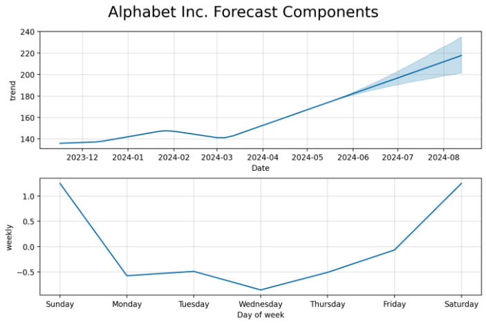
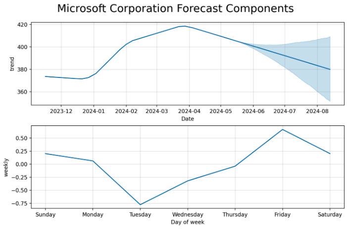

# MarketMatrix Pro - A Stock Exploration Tool

**Contributors:** 
* Gavin Kingston
* David Moyes 
* Rob Pavlik 
* Jaime Portillo 

### Summary
This tool will take in a user input with a comma delimited list of ticker symbols of stock market or crypto tickers and it will gather as much data on that symbol as possible of all closing prices based on a user provided frequency. It will then provide predictions on what the next best trade will be in the same frequency

### Questions
* What is the best time to buy, and what is the best time to sell
* what is the overall trend of the stock ticker symbol
* What month, day, time is the best time to buy or sell the stock. 

### Requirements
* Install Python [here](https://www.python.org/downloads/)
* Install Python Libraries (instructions listed below)
* Javascript enabled web browser

### Instructions
* Download the code
* Navigate into the parent directory of the source code using terminal
* Run the following command in terminal to install the required python libraries and run the program
```
pip install -r requirements.txt && streamlit run main.py
```

** Note: If you run into an error saying that the streamlit.cli is an unknown command. A workaround is to run the following to reinstall the streamlit module**
```
pip uninstall streamlit
pip install streamlit
```

### Application in Action


### Summary and Results
* The best time (day, week, month) to buy a specific stock is going to be different depending on the range and stock you are evaluating. We can see the differences between Google and Microsoft's trends below.



* The tool is likely better suited for a user who has a strong understanding of stock market analysis and knows what factors to consider. Just because the predictive model shows a stock with a downward trend doesn't mean that company is going out of business; it may actually be an indicator to buy.
* The tool does allow us to dynamically answer our original questions about the best time to buy or sell, tracking historical changes, and predicting future changes, but it is best used as a short-term research tool due to limitations with the accuracy of the predictive model over the long-term.

